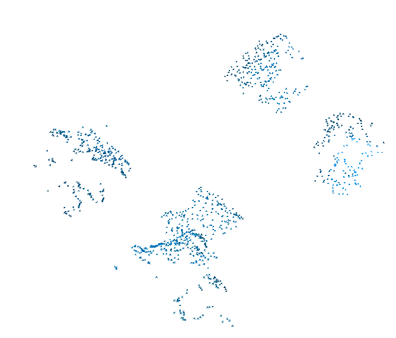
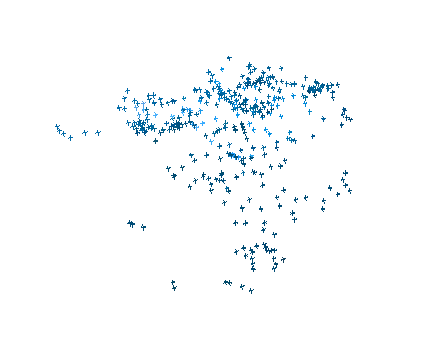
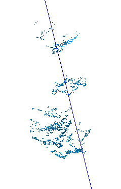

# Why are the distances given by the RealSense SO BAD???
* `[Y]` Inaccurate transform to camera, "ze_cam_xform_cal.py", 2025-02-06: No improvement

* `[>]` Inaccurate camera intrinsics
    - 2025-02-12: Found a different means of obtaining intrinsics online, No improvement
    - `[N]` [Run calibration, but use the printed values instead of the stored values](https://support.intelrealsense.com/hc/en-us/community/posts/21405010455443/comments/21516681407507), 2025-02-13: This was not necessary and Open3D does not take distortion into account anyway
    - `[Y]` Re-run block PCD display, 2025-02-13: pyrealsense2 takes the RealSense distortion model into account!
    - `[Y]` Where are the TRANSFORMED point clouds?, 2025-02-12: There is a spread and I don't like it!
           
        2025-02-13: The second shot takes the RealSense distortion model into account!
    - `[>]` Can I reshape the large array from pyrealsense2 in a sane manner?

* `[Y]` Bad Calibration, 2024-12-XX: Marginal improvment.
* `[Y]` [I would also recommend checking that the Threshold Filter option in the Post-Processing section of the Viewer's stereo module options is not enabled in order to ensure that the depth image is rendering the full distance of detail that it is able to observe instead of being limited](https://github.com/IntelRealSense/librealsense/issues/8258#issuecomment-768931256), 2025-02-06: No improvement
    1. Install viewer: `sudo apt-get install librealsense2-utils`
    1. Run: `realsense-viewer`
        - `[>]` Viewer recommends a firmware update 
            1. `rs-fw-update -l` to launch the tool and print a list of connected devices.
                * Intel RealSense D405 s/n 126122270157, update serial number: 125423070233, firmware version: 5.15.1
            1. Download: https://dev.intelrealsense.com/docs/firmware-releases-d400
            1. Unzip and navigate to directory with the unzipped BIN file
            1. `rs-fw-update -s 125423070233 -f Signed_Image_UVC_5_16_0_1.bin`, Replace file name with current
            1. `rs-fw-update -l`, Confirm update
    - 2025-02-06: Setting turned off, but there is no difference in the viewer
    - 2025-02-06: Tried other adjustments via the sliders, no performance improvement in the viewer

* `[Y]` Characterize Problem
    - `[Y]` Segment ONE BLOCK from several different angles, 2025-02-12: Ran segmentation with Blue Block only
    - `[Y]` Where are the UN-transformed point clouds?, 2025-02-12: Basically in the sam neighborhood but a little spread out, tough to say
        
    

* `[P]` System Identification: Camera Transform, 2025-02-14: PAUSED
    - `[P]` Generate Checkerboard
    - `[P]` Print Checkerboard
    - `[P]` What is the data?
        * Color images
        * Checkerboard poses
    - `[ ]` What is the error function?
        * Sum of distances from the pose average???
        * Express the transform as 6 parameters: Position + Axis-Angle
    - `[ ]` Optimization inner loop
        * What is the error jacobian expression?
        * Linearize the error jacobian
        * Optimize
    - `[ ]` Optimization outer loop
        * Get a new estimate of the params
        * Inner loop based on those params
    - `[ ]` Optimize transform

# Alternate Paths
* Match known cube to the image using edge detection
    - This KILLS open vocab